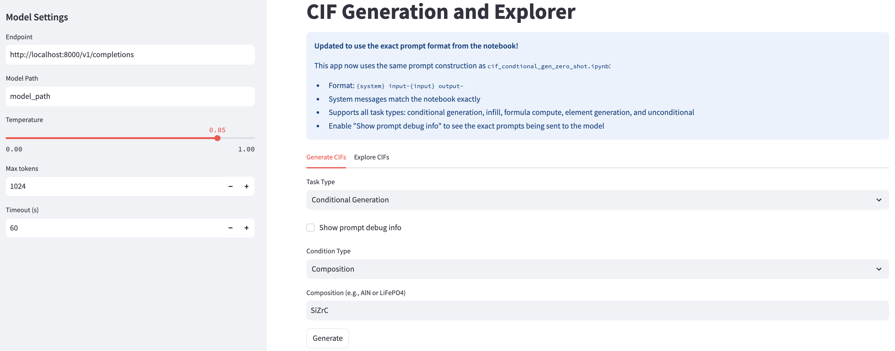
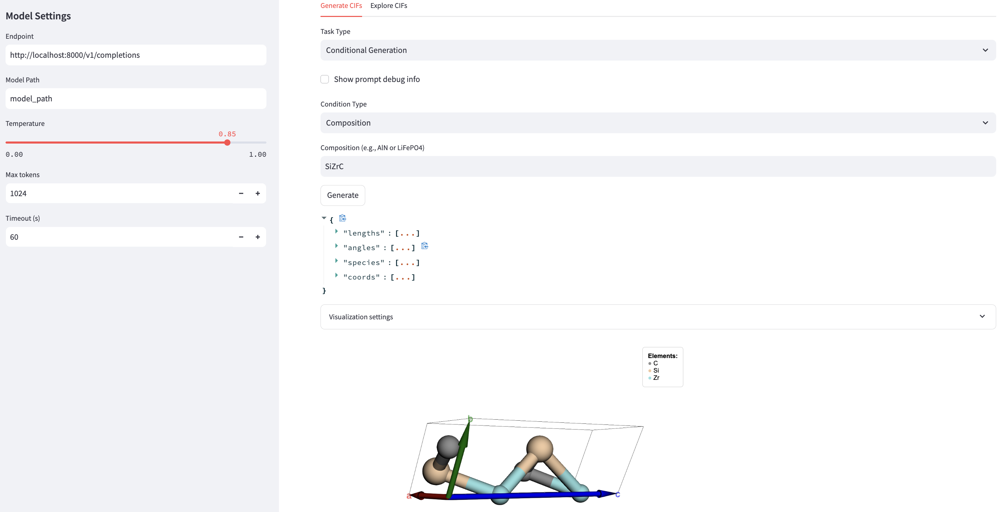
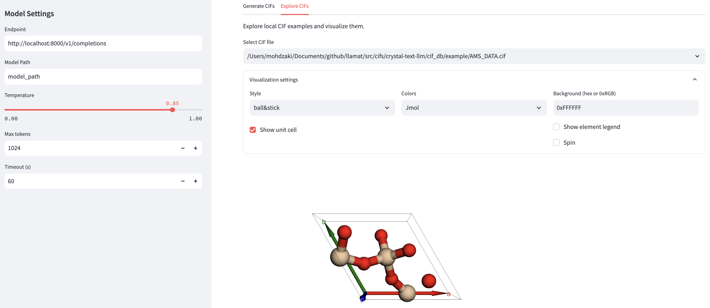

# CIF Dashboard, Visualization and Batch Generation

## Launching streamlit dashboard

```
streamlit run streamlit_app.py
```

### Examples

The following snapshot shows the conditional generation exmple with compositional constraint.



The following snapshot shows the conditional generation exmple with compositional constraint.


The following snapshot shows the generated output.



The same dashboard also has the facility to visualise locally stored CIFs. Here is an example of visualising AMS_CIF



## Usage Instructions for batch generations

### Sequential Processing (Recommended for single GPU)
```python
# Run sequential generation - safer for single A100 GPU
result_df = run_sequential_generation()
```

### Parallel Processing (Use with caution)
```python
# Run parallel generation with 2 workers (recommended for single GPU)
result_df = run_parallel_generation(max_workers=2)

# For more aggressive parallelization (monitor GPU memory)
result_df = run_parallel_generation(max_workers=4)
```

### Custom Configuration
```python
# Custom sequential generation
result_df = batch_generate_sequential(
    df, 
    model_names['llamat-2-cif'],
    max_tokens=1024,
    temperature=0.01,
    top_p=0.95,
    save_freq=100,  # Save every 100 generations
    output_file="my_custom_results.csv"
)

# Custom parallel generation
result_df = batch_generate_parallel(
    df, 
    model_names['llamat-2-cif'],
    max_workers=2,  # Conservative for single GPU
    max_tokens=1024,
    temperature=0.01,
    top_p=0.95,
    save_freq=50,   # More frequent saves for parallel
    output_file="my_parallel_results.csv"
)
```

## Recommendations for Single A100 40GB GPU

**For your setup, I recommend:**

1. **Start with Sequential Processing**: Use `run_sequential_generation()` first
   - More stable and predictable
   - Lower memory usage
   - Easier to debug if issues arise

2. **If you want parallelization**: Use `run_parallel_generation(max_workers=2)`
   - Start with 2 workers maximum
   - Monitor GPU memory usage
   - Increase gradually if stable

3. **Avoid high parallelization** (4+ workers) on single GPU as it may cause:
   - Memory overflow
   - Request timeouts
   - Server instability


## Features

- ✅ **Progress tracking** with tqdm
- ✅ **Error handling** for failed requests
- ✅ **Periodic saving** to prevent data loss
- ✅ **Checkpoint files** for recovery
- ✅ **Both sequential and parallel** options
- ✅ **Configurable parameters** (temperature, max_tokens, etc.)
